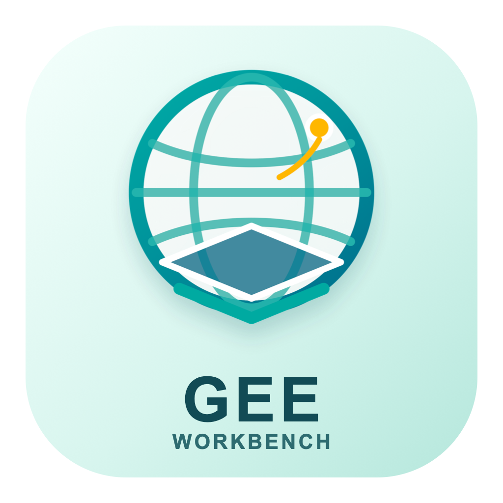

<p align="center">
  
</p>

# GEE Workbench for macOS

<p align="center">
  <a href="README.md">English</a> | <strong>简体中文</strong>
</p>

[](https://github.com/Shaowen-Ye/gee-workbench-macos/actions/workflows/macos-ci.yml)
[](LICENSE)

> **非官方社区项目。** 本项目与 Google 没有隶属、认可或赞助关系。

GEE Workbench for macOS 是一个注重隐私的科研工作台，将 Google Earth
Engine Python API、geemap、JupyterLab Desktop 和 QGIS 衔接到同一套可复现的
本地工作流中。它主要面向生态环境、遥感、鱼类学、保护与修复等需要空间数据的
研究场景。

## 它能做什么

GEE Workbench 不是 Earth Engine、JupyterLab 或 QGIS 的替代品，而是它们之间的轻量
集成与管理层：

- 为 Earth Engine 和 geemap 建立隔离的 Python 环境；
- 生成带自定义非 Google 图标的 macOS 一键启动器；
- 使用正确的 Python 环境打开预置 Jupyter Notebook；
- 从本地配置文件或环境变量读取 Google Cloud 项目 ID；
- 以只读方式检查项目健康状态、资产、任务和配额；
- 提供仅使用 Earth Engine 公开数据、不保存运行输出的示范 Notebook；
- 说明如何将结果继续交给 QGIS 做空间检查和专业制图；
- 将凭据、私有资产标识和科研数据留在 Git 仓库之外。

## 功能边界与安全性

- 命令行工具为只读模式，不会删除、移动、重命名或共享 Earth Engine 资产。
- 身份验证信息由 Earth Engine 的标准用户凭据存储机制管理。
- 配置保存在 `~/.config/gee-workbench/config.toml`，不在 Git 仓库内。
- 公开示范不包含私有坐标、项目 ID、资产 ID、任务 ID 或科研数据。
- 使用 `--output` 生成的 JSON 报告可能包含您的项目、资产或任务标识，应将它们视为
  私有科研记录。

## 系统要求

- macOS 12 或更高版本；
- Python 3.11 或更高版本，安装器优先使用 Homebrew Python 3.12；
- 已注册的 Google Earth Engine 账户和 Google Cloud 项目；
- 已在本机 Mac 完成 Earth Engine 授权；
- 使用一键桌面启动器时需要 JupyterLab Desktop；
- 可选：使用 QGIS 进行桌面 GIS 检查和出版级制图。

## 安装

克隆仓库并运行安装器：

```bash
git clone https://github.com/Shaowen-Ye/gee-workbench-macos.git
cd gee-workbench-macos
./scripts/install.sh
```

安装器会创建：

- 位于 `~/.local/share/gee-workbench` 的应用环境；
- 位于 `~/.config/gee-workbench/config.toml` 的本地配置；
- 位于 `~/Applications` 的 `GEE Workbench.app`。

应用会在本机生成并进行 ad-hoc 签名。当前版本尚不直接分发经 Apple 公证的
`.app` 或 `.dmg` 二进制包。

## 配置与授权

编辑配置文件，将占位符替换为您的 Google Cloud 项目 ID：

```toml
project = "your-google-cloud-project"
asset_root = "projects/your-google-cloud-project/assets"
```

也可在当前终端会话中使用环境变量覆盖配置：

```bash
export EE_PROJECT="your-google-cloud-project"
export EE_ASSET_ROOT="projects/your-google-cloud-project/assets"
```

如果尚未完成 Earth Engine 授权，请激活已安装的环境并运行：

```bash
source ~/.local/share/gee-workbench/.venv/bin/activate
earthengine authenticate
```

该命令会打开 Google 授权流程，凭据不会被复制到本仓库。

## 启动桌面工作台

可以通过 Finder、Spotlight 或 Alfred 打开 `GEE Workbench.app`。启动器会：

1. 定位隔离的 Python 环境；
2. 定位 JupyterLab Desktop 命令行程序；
3. 在项目工作区中打开 `notebooks/public_demo.ipynb`。

如果找不到 JupyterLab Desktop，请先安装它，然后重新运行 `./scripts/install.sh`。

## 只读命令行工具

激活已安装的环境：

```bash
source ~/.local/share/gee-workbench/.venv/bin/activate
```

可用命令：

```bash
gee-workbench doctor
gee-workbench assets
gee-workbench tasks
```

仅在必要时将结果保存为报告：

```bash
gee-workbench doctor --output reports/doctor.json
```

`reports/` 目录默认已被 Git 忽略。

## 公开示范 Notebook

`notebooks/public_demo.ipynb` 包含：

1. 授权与项目初始化；
2. 项目健康状态摘要；
3. 只读资产盘点；
4. 任务监测；
5. 使用公开高程和地表水数据的 geemap 交互地图；
6. Earth Engine Code Editor 和 Data Catalog 链接。

仓库中的 Notebook 不包含执行计数或已保存输出。请在设置自己的项目 ID 后运行。

## 与 QGIS 协同

QGIS 仍然是独立的桌面 GIS 应用。一个典型工作流是：

1. 在 Earth Engine 中计算或提取遥感变量；
2. 将经确认的结果导出为 GeoTIFF、GeoPackage、GeoJSON 或 CSV；
3. 在 QGIS 中检查 CRS、几何、栅格对齐和 NoData 处理；
4. 在 QGIS 中完成地图样式、版式、图例、标注和出版输出。

本仓库不再分发 QGIS 或第三方 QGIS 插件。

## 项目结构

```text
config/                  本地配置示例
docs/                    架构和隐私说明
launcher/macos/          启动器源码与图标资源
notebooks/               不含输出的公开示范
scripts/                 安装、卸载和隐私扫描脚本
src/gee_workbench/       只读 Python 管理命令行工具
tests/                   单元测试和 macOS 安装冒烟测试
```

## 卸载

删除应用但保留本地配置：

```bash
./scripts/uninstall.sh
```

同时删除本地配置：

```bash
./scripts/uninstall.sh --purge-config
```

## 开发与验证

```bash
python3 -m venv .venv
source .venv/bin/activate
python -m pip install -e '.[dev]'
ruff check src tests
pytest -q
bash scripts/privacy_scan.sh
bash tests/smoke.sh
```

每次公开发布都会执行 macOS CI、Python 测试、ShellCheck、Notebook 结构检查、
仓库隐私扫描、gitleaks、CodeQL 和临时用户目录安装测试。

## 数据治理

对权威原始数据保持只读，并分离原始、标准化、分析就绪、代码、输出和公开发布层。在将 AI
或 GEE 生成的结果用于科学发表或管理决策之前，应核验坐标参考系、单位、时间范围、缺失值、
栅格对齐和采样站点身份。

## 文档

- [架构说明](docs/architecture.md)
- [隐私与数据治理](docs/privacy.md)
- [安全政策](SECURITY.md)
- [第三方软件说明](THIRD_PARTY_NOTICES.md)
- [贡献指南](CONTRIBUTING.md)

## 商标说明

Google Earth Engine 和 Google 是 Google LLC 的商标。本项目仅以纯文本方式使用这些名称，
用于说明 API 兼容性；未使用 Google 徽标、产品图标或官方视觉识别元素。

## 许可与引用

本仓库原创源码使用 [MIT License](LICENSE)。Earth Engine 及各数据集的使用仍受其适用
条款和许可约束。软件引用信息见 [CITATION.cff](CITATION.cff)。
